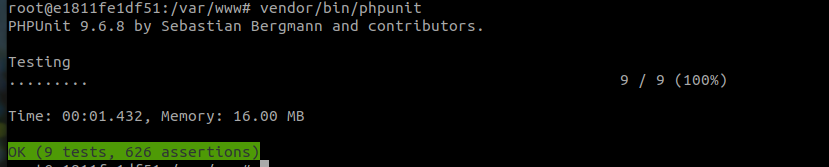
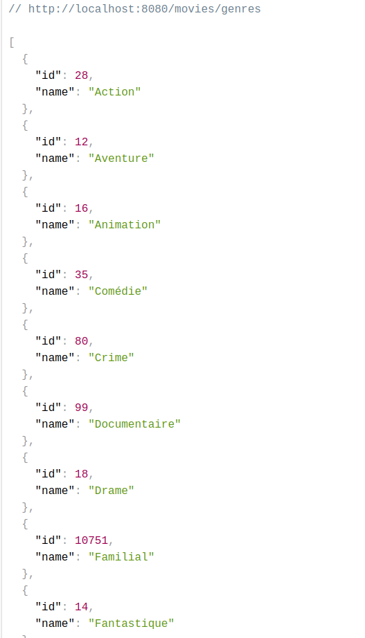
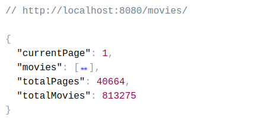
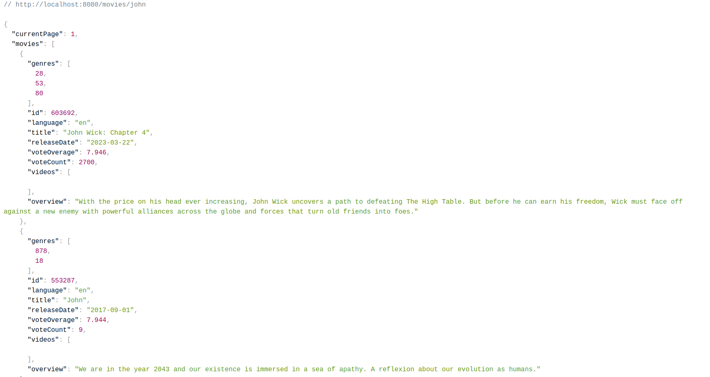
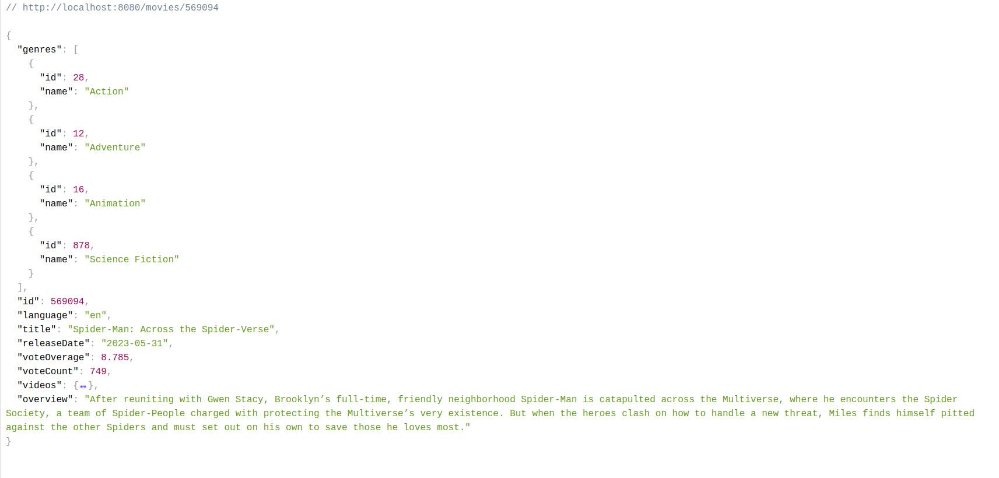

# “We Movies”

### Lancer l'application :
```batch
docker-compose up -d
```
Ouvrir le navigateur et accéder à cette url http://localhost:8080

### Lancer les tests:
Exécuter cette commande dans le container PHP:
```batch
vendor/bin/phpunit
```


### Choix techniques :
* Architecture Hexagonale
* Composant HttClient pour faire les appels API
* Tests d'intégrations: Mes uses cases (application services) sont des humble objects (passe-plat, ils font que de l'orchestration). Du coup, ce n'est pas pertinent ici de commencer par des tests unitaires. Donc mes tests font le focus sur l'intégration de l'api movies et le mapping vers les contrats exigés par l'application service qui doivent être respectés par les adapters.
  On peut dire aussi que je fais du contract testing simple pour vérifier que rien n'est cassé et que l'api movie fonctionnent comme prévu.
* clean code, DRY, KISS, YAGNI, SOLID ... (sur le code de production et les tests aussi)
* utilisation des traits pour les tests histoire d'éviter la duplication du code et ainsi gagner de la visibilité sur les scénarios des tests 

### Axes d'améliorations :
* La gestion des erreurs/exceptions (discussion indispensable avec le métier pour décider la bonne manière de faire : avec le pattern decorator, utilisation des middlewares, gestion simple avec des messages pour l'UX etc)
* Il peut être envisagé de découpler le front-end et le back-end si nécessaire, en fonction du contexte et de la complexité du domaine (si l'application grossit).
* Ajouter un pipeline sur github (ou autre outil) avec des jobs : build, tests, QA (respecter les standards PSR PHP et Symfony : phpcsfixer, sonarQube, phpstan etc), deploy vers un environnement de recette
* Ajouter la librairie Deptrac pour controller la non violation de l'architecture hexagonale et le sens de la règle de dépendance
* Avoir un figma pour la partie front et connecter les "composants" front aux actions back (pas eu le temps d'avancer sur la partie front)
### Exemple de résultat :
* Quelques images sur les retours des routes en json avant l'implémentation de la partie front :  


  1. **La liste des genres :**
 


  2. **La liste des films :**
 


  3. **La liste des films correspondant à une recherche par titre :**



  4. **Les détails d'un film selectionné :**


